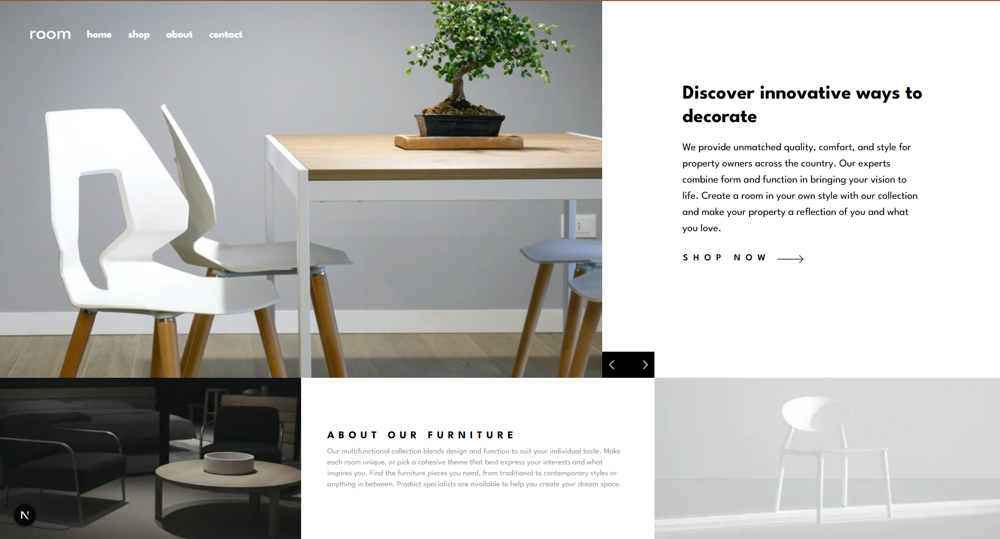

# Frontend Mentor - Room homepage solution

This is a solution to the [Room homepage challenge on Frontend Mentor](https://www.frontendmentor.io/challenges/room-homepage-BtdBY_ENq). Frontend Mentor challenges help you improve your coding skills by building realistic projects.

- [Overview](#overview)
  - [The challenge](#the-challenge)
  - [Screenshot](#screenshot)
  - [Links](#links)
- [My process](#my-process)
  - [Built with](#built-with)
  - [What I learned](#what-i-learned)
- [Author](#author)
- [Acknowledgments](#acknowledgments)

## Overview

### The challenge

Users should be able to:

- View the optimal layout for the site depending on their device's screen size
- See hover states for all interactive elements on the page
- Navigate the slider using either their mouse/trackpad or keyboard

### Screenshot

### Links

- Solution URL: https://github.com/Fanu-Cd/frontend-mentor-room-homepage
- Live Site URL: 'https://frontend-mentor-room-homepage-taupe.vercel.app/'

### My process

### Built with

- Semantic HTML5 markup
- CSS custom properties
- Flexbox
- Mobile-first workflow
- [React](https://reactjs.org/) - JS library
- [Next.js](https://nextjs.org/) - React framework
- [Tailwindcss](https://tailwindcss.com/) - CSS Framework
- [Mantine UI](https://mantine.dev/) - UI Library
- [Vite](https://vite.dev/) - Build tool

### What I learned

What I Learned While I Implemented the Room homepage challenge

- Translating the given UI designs into clean, responsive layout requires strong attention to detail and layout logic.
- Managing layout differences across screen sizes helped sharpen my skills with CSS Flexbox, and responsive design principles.
- Fine-tuning hover and focus states across devices improved my understanding of accessible UI patterns.
- Recreating a pixel-perfect layout demanded critical thinking and problem-solving—especially when aligning elements that behave differently across screen widths.

## Author

- Website - [Fanuel Amare](http://fanuel-amare-personal-portfolio-v2.vercel.app/)
- Frontend Mentor - [@Fanu-Cd](https://www.frontendmentor.io/profile/Fanu-Cd)
